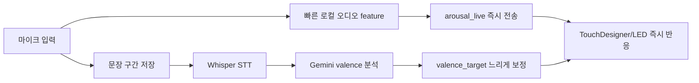
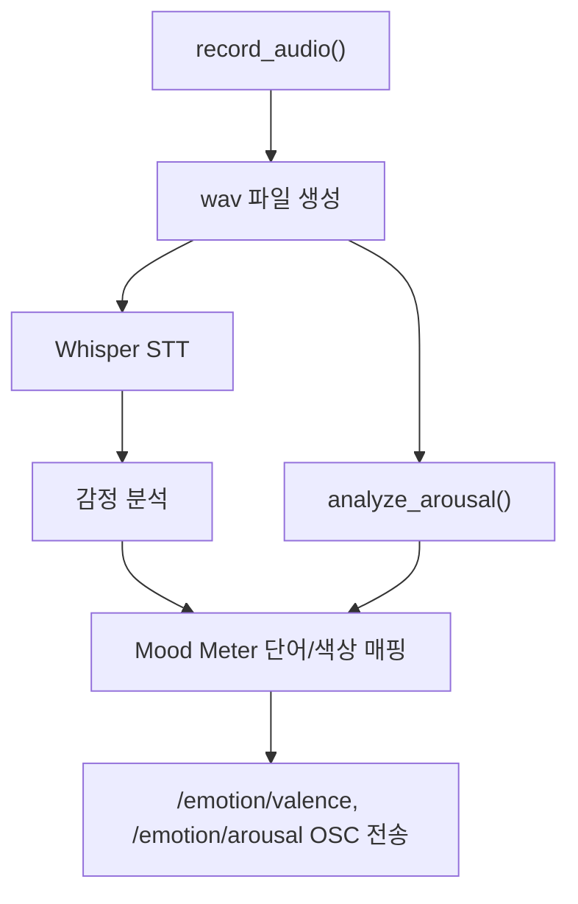
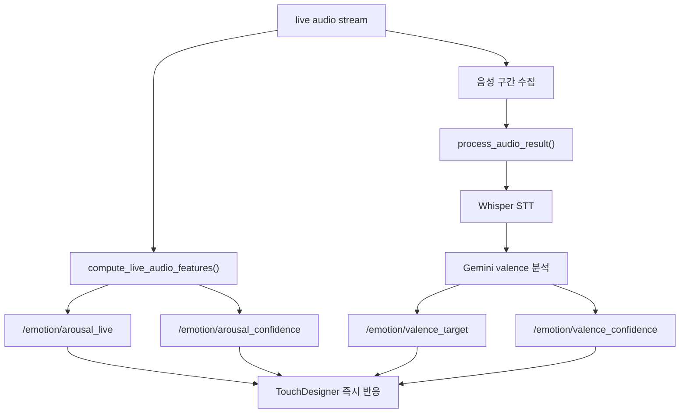

# 변경 맥락 정리

작성 기준: 2026-05-14  
비교 기준: `origin/main` -> 현재 브랜치 `codex/live-emotion-ser-integration`

이 문서는 `media_art_backend`가 기존 GitHub `main`과 어떻게 달라졌는지, 그리고 왜 그렇게 바꿨는지 팀원이 빠르게 이해할 수 있도록 정리한 문서입니다.

## 먼저 3줄 요약

기존 코드는 "녹음이 끝난 뒤 분석해서 TouchDesigner로 보내는 backend"에 가까웠습니다.

현재 브랜치는 "소리가 들어오는 즉시 반응하는 live signal backend"로 바뀌었습니다. 빠른 시각 반응은 로컬 오디오 feature에서 만들고, 문장의 의미를 봐야 하는 감정 판단은 느린 보정 레이어로 분리했습니다.

그래서 핵심 변화는 `arousal`과 `valence`를 같은 속도로 처리하지 않는 것입니다. `arousal`은 즉시 움직이고, `valence`는 나중에 천천히 갱신됩니다.

## 왜 구조를 바꿨나

### 문제 1. Whisper/Gemini는 즉시 반응용으로 느립니다

기존 흐름은 대략 이랬습니다.


이 방식은 문장이 끝난 뒤 분석 결과를 보내기에는 괜찮습니다. 하지만 LED나 TouchDesigner visual이 목소리에 바로 반응해야 하는 상황에서는 체감이 늦습니다.

특히 다음 작업은 즉시 처리하기 어렵습니다.

- 말을 시작하자마자 밝기나 움직임이 올라가는 반응
- 목소리가 커질 때 pattern speed, displacement, blur가 바로 바뀌는 반응
- 말이 끝나기 전에 LED가 먼저 살아나는 반응

그래서 실시간 반응과 의미 분석을 분리했습니다.

### 문제 2. `arousal`과 `valence`는 성격이 다릅니다

`arousal`은 흥분도, 에너지, 강도에 가깝습니다. 목소리의 크기, 파형, spectral centroid, zero crossing 같은 오디오 feature만 봐도 빠르게 추정할 수 있습니다.

`valence`는 긍정/부정 방향입니다. 이 값은 단순히 소리가 크다고 알 수 없습니다. 문장 내용, 단어, 맥락을 봐야 하므로 STT와 LLM 분석이 필요합니다.

그래서 현재 브랜치의 기준은 아래처럼 바뀌었습니다.



## 전체 변경량

`origin/main` 대비 현재 브랜치의 변경량입니다.

```text
2 commits ahead
19 files changed
2561 insertions(+)
127 deletions(-)
```

추가된 주요 파일:

```text
ambient_emotion.py
live_signal.py
local_ser.py
web_app.py
tests/
web/
```

수정된 주요 파일:

```text
main.py
README.md
requirements.txt
.env.example
.gitignore
```

## 바뀐 흐름 한눈에 보기

### 기존 `main` 기준 흐름



기존 흐름은 분석 결과 하나를 만든 뒤 보내는 구조입니다. 구현은 단순하지만, 분석이 끝나기 전까지 visual이 기다려야 합니다.

### 현재 브랜치 흐름



현재 흐름은 두 속도의 신호를 같이 씁니다.

- 빠른 신호: `arousal_live`, `arousal_confidence`
- 느린 신호: `valence_target`, `valence_confidence`

## 새 OSC channel이 생긴 이유

기존 TouchDesigner 쪽은 아래 두 값을 주로 기대했습니다.

```text
/emotion/valence
/emotion/arousal
```

그런데 live 구조에서는 "현재 바로 움직일 값"과 "나중에 확정되는 값"을 구분해야 합니다. 그래서 새 channel을 추가했습니다.

```text
/emotion/arousal_live
/emotion/arousal_confidence
/emotion/valence_target
/emotion/valence_confidence
```

각 channel의 의미는 아래와 같습니다.

| Channel | 의미 | 추천 사용처 |
| --- | --- | --- |
| `/emotion/arousal_live` | 현재 소리에서 바로 계산한 흥분도 | 밝기, 속도, 흔들림, blur, displacement |
| `/emotion/arousal_confidence` | 지금 arousal 값을 믿어도 되는 정도 | arousal 영향력 gain/blend |
| `/emotion/valence_target` | STT/Gemini 이후 갱신되는 긍정/부정 방향 | 색상, 분위기, 장면 전환 목표값 |
| `/emotion/valence_confidence` | valence 값을 믿어도 되는 정도 | valence 반영 강도 |

기존 channel도 바로 제거하지 않았습니다. `send_live_osc(...)`가 새 live 값을 legacy channel에도 mirror합니다.

```text
/emotion/arousal_live -> /emotion/arousal
/emotion/valence_target -> /emotion/valence
```

이렇게 한 이유는 TouchDesigner 기존 network를 한 번에 깨지 않기 위해서입니다. 기존 표현식이나 CHOP가 `/emotion/valence`, `/emotion/arousal`를 보고 있어도 계속 동작할 수 있게 만든 호환 레이어입니다.

## 파일별 역할

### `main.py`

기존 backend의 중심 파일입니다. 현재 브랜치에서 역할이 넓어졌습니다.

주요 변경:

- API client를 import 시점에 만들지 않고 `get_gemini_client()`, `get_openai_client()`에서 필요할 때 만듭니다.
- API key가 없어도 module import와 테스트가 가능해졌습니다.
- `compute_live_audio_features(...)`가 추가되어 live `arousal`를 빠르게 계산합니다.
- `send_live_osc(...)`가 추가되어 새 live OSC channel을 보냅니다.
- `process_audio_result(...)`가 추가되어 웹 UI가 표시할 수 있는 dict 결과를 반환합니다.
- 기존 `process_audio(...)`는 terminal용 compatibility wrapper로 남았습니다.

왜 이렇게 했나:

- 테스트와 웹 서버가 단순 import만 해도 API key 때문에 죽는 문제를 막기 위해서입니다.
- 터미널 실행, 웹 UI 실행, 테스트 실행이 같은 분석 함수를 재사용하게 하려는 목적입니다.
- live path와 기존 batch path를 한 파일 안에서 연결하되, 기존 호출 방식은 최대한 유지했습니다.

### `live_signal.py`

실시간 신호를 안정화하는 작은 utility 모음입니다.

담당하는 일:

- `NoiseFloorTracker`: 조용한 상태의 기준 noise floor 추적
- `EnvelopeSmoother`: 값이 튀지 않게 attack/release smoothing
- `SegmentEndpoint`: 말이 시작되고 끝나는 시점 판단
- `SpeakerBleedGate`: reference mic가 있을 때 speaker bleed를 줄이는 heuristic
- `compose_led_mood_signal(...)`: LED로 보낼 `valence/arousal` 조합 결정

왜 따로 뺐나:

- live 반응 로직은 테스트하기 쉬워야 합니다.
- `main.py`에 모두 넣으면 녹음, STT, OSC, signal smoothing이 섞여서 이해하기 어려워집니다.
- 여기 로직은 API key나 장치 없이도 순수 함수/클래스처럼 테스트할 수 있습니다.

### `local_ser.py`

SER 모델 통합을 위한 자리입니다.

현재 상태:

- `RollingSerWindow`는 최근 audio window를 모읍니다.
- `LocalSerFallback`은 실제 모델이 아니라 fallback adapter입니다.

중요한 caveat:

아직 실제 Speech Emotion Recognition 모델이 붙은 것은 아닙니다. 모델 선택, dependency, confidence calibration은 남은 작업입니다.

왜 미리 만들었나:

- 나중에 SER 모델을 붙일 때 live loop 전체를 다시 갈아엎지 않기 위해서입니다.
- 지금은 "모델 통합 위치"만 마련해 둔 상태입니다.

### `ambient_emotion.py`

여러 감정 결과를 confidence 기반으로 평균내는 작은 모듈입니다.

현재 상태:

- `average_mood(items)`만 제공합니다.
- Gemini batch/background integration은 아직 없습니다.

왜 만들었나:

- 실시간 입력이 없을 때 LED/TD가 갑자기 죽는 대신, 최근 분위기나 배경 mood를 유지할 수 있게 하려는 준비입니다.
- 지금은 future layer를 위한 계산 단위만 들어 있습니다.

### `web_app.py`

터미널 명령 대신 브라우저에서 backend를 제어하기 위한 local web server입니다.

주요 endpoint:

```text
GET  /api/status
GET  /api/live/status
GET  /api/health
POST /api/start
POST /api/live/start
POST /api/live/stop
POST /api/test-osc
```

왜 만들었나:

- 팀원이 Python terminal을 계속 보지 않아도 테스트할 수 있게 하기 위해서입니다.
- TouchDesigner와 OSC 연결 상태를 브라우저에서 확인하기 쉽게 만들기 위해서입니다.
- live start/stop, test OSC, 결과 확인을 버튼으로 할 수 있게 하려는 목적입니다.

### `web/`

브라우저 UI입니다.

주요 파일:

```text
web/index.html
web/app.js
web/style.css
web/serial_visualizer.html
web/serial_visualizer.js
```

역할:

- `index.html` / `app.js`: backend 실행, live start/stop, test OSC 버튼 제공
- `serial_visualizer.html` / `serial_visualizer.js`: Arduino protocol `v,<valence>,<arousal>`를 시각화하고 Web Serial로 테스트

왜 만들었나:

- Arduino/TouchDesigner 연결은 눈으로 확인하는 테스트가 중요합니다.
- serial payload가 제대로 만들어지는지 브라우저에서 바로 볼 수 있게 했습니다.

### `tests/`

이번 브랜치에서 새로 추가된 테스트입니다.

검증하는 것:

- live arousal 계산이 silence/loud signal에서 다르게 나오는지
- OSC live channel이 legacy channel로 mirror되는지
- API client가 import 시점에 생성되지 않는지
- confidence와 clamp가 안정적으로 동작하는지
- web test path가 live OSC 값을 보내는지
- rolling SER window가 window 크기와 overflow를 잘 처리하는지

왜 추가했나:

- live signal 로직은 작은 수치 변화가 전체 visual 느낌을 바꿀 수 있습니다.
- API나 장치 없이도 최소한의 계산 규칙은 깨지지 않게 막아야 합니다.

## 팀원이 헷갈리기 쉬운 지점

### 1. `valence`와 `arousal`은 동시에 확정되지 않습니다

`arousal`은 마이크에서 거의 바로 나옵니다.  
`valence`는 문장이 끝나고 STT/Gemini 분석이 끝난 뒤 나옵니다.

따라서 live UI나 TouchDesigner에서 두 값을 같은 타이밍의 완성된 감정값처럼 보면 안 됩니다.

### 2. `LocalSerFallback`은 실제 SER 모델이 아닙니다

이름 때문에 헷갈릴 수 있습니다. 현재는 실제 모델 inference가 아니라, 앞으로 모델을 붙이기 위한 adapter/fallback 자리입니다.

### 3. legacy OSC channel은 일부러 남겨 둔 것입니다

`/emotion/valence`, `/emotion/arousal`는 구식이라 바로 지운 것이 아닙니다. TouchDesigner 기존 network가 이 이름을 보고 있기 때문에 compatibility를 위해 유지했습니다.

### 4. Gemini는 실시간 반응 엔진이 아닙니다

현재 구조에서 Gemini는 느린 valence refinement입니다. 즉각적인 visual 반응은 `sound intensity`, `pitch`, `waveform`, `arousal_live` 중심으로 잡는 것이 맞습니다.

### 5. TouchDesigner 저장 위치를 확인해야 합니다

README 기준으로 마지막에 저장 확인된 파일은 아래입니다.

```text
C:\Users\kksu1\Downloads\Innerworld\Innerworld\Innerworld.23.toe
```

하지만 planned/canonical 위치로 언급되는 파일은 별도입니다.

```text
C:\Users\kksu1\Documents\New project\innerworld\Innerworld\Innerworld.toe
```

다음 작업자는 어떤 `.toe`를 열고 있는지 먼저 확인해야 합니다.

## 현재 상태와 검증

확인한 검증 결과:

```text
.\venv311\Scripts\python.exe -m unittest discover -s tests -v
Ran 35 tests in 5.235s
OK
```

추가 syntax check:

```text
.\venv311\Scripts\python.exe -m py_compile main.py web_app.py live_signal.py local_ser.py ambient_emotion.py
node --check web\app.js
node --check web\serial_visualizer.js
```

위 명령은 모두 통과했습니다.

주의:

```text
.\venv311\Scripts\python.exe -m pytest -q
```

이 명령은 현재 `venv311`에 `pytest`가 없어서 실패했습니다. 테스트 코드 자체는 `unittest` 기반이라 `python -m unittest discover -s tests -v`로 검증했습니다.

## 다음 작업자가 보면 좋은 순서

처음부터 모든 파일을 읽으려 하면 복잡합니다. 아래 순서로 보면 이해가 빠릅니다.

1. `CHANGE_CONTEXT.md`
   - 전체 맥락과 왜 바뀌었는지 확인합니다.

2. `README.md`
   - 실행 방법, OSC channel, TouchDesigner bridge 상태를 봅니다.

3. `main.py`
   - 기존 batch 분석과 새 live OSC helper가 어떻게 연결되는지 봅니다.

4. `live_signal.py`
   - 실시간 신호를 어떻게 안정화하는지 봅니다.

5. `web_app.py`
   - 브라우저 UI와 backend API가 어떻게 연결되는지 봅니다.

6. `web/serial_visualizer.js`
   - Arduino protocol 테스트가 어떻게 동작하는지 봅니다.

7. `tests/`
   - 어떤 동작을 고정된 규칙으로 보고 있는지 확인합니다.

## 한 문장으로 정리

이번 브랜치는 감정 분석 정확도를 한 번에 완성하려는 변경이 아니라, media art system이 먼저 살아 움직일 수 있도록 `arousal` 즉시 반응 경로를 만들고 `valence` 의미 분석을 느린 보정 경로로 분리한 변경입니다.
